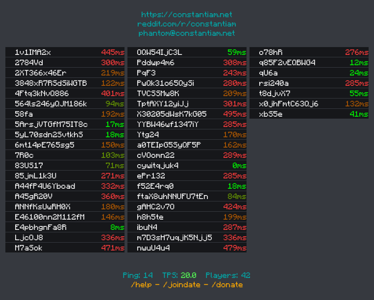

# tabdrawer

Golang library to draw tab list of minecraft servers



Example under `example/constantiam`

You can ask for live demo in my [discord](https://discord.com/invite/DFsMKWJJPN)

Requires golang 1.19

## Configuration

In order to render tab you need to collect together some styling:

```go
type TabParameters struct {
 // LatencyColoring func that returns color of latency text that you desire
 // if nil DefaultLatencyColoring is used
 LatencyColoring func(int) color.Color

 // LatencyStyle do you want "ms" at the end?
 LatencyStyle LatencyStyling

 // ChatColorCodes Issues with color contrast? You can change it here
 // if nil DefaultChatColorCodes is used
 ChatColorCodes map[string]color.RGBA

 // BackgroundColor if nil DefaultDiscordBackgroundColor
 BackgroundColor color.Color

 // BackgroundColor if nil DefaultPlayerBackgroundColor
 PlayerBackgroundColor color.Color

 // RowSpacing distance between rows
 RowSpacing float64

 // RowAdditionalHeight adds space above and below text in rows (measures to keep weird symbols inside their rows)
 RowAdditionalHeight float64

 // ColumnSpacing distance between columns
 ColumnSpacing float64

 // MaxRows how many rows will be in one column at max
 MaxRows int

 FontColor color.Color
 Font      font.Face

 // OverridePlayerName if not nil can override rendering of particular uuid (must not be multiline), can return nil
 OverridePlayerName func(uuid.UUID) *chat.Message

 // SortFunction used to sort player names if nil DefaultPlayerSorter is used (sorts by name)
 SortFunction func(a []uuid.UUID, p map[uuid.UUID]TabPlayer, i int, j int) bool

 // LineSpacing spacing between lines in tab text (top and bottom)
 LineSpacing float64

 DebugTopBottom bool
 DebugHeight    bool
}
```
